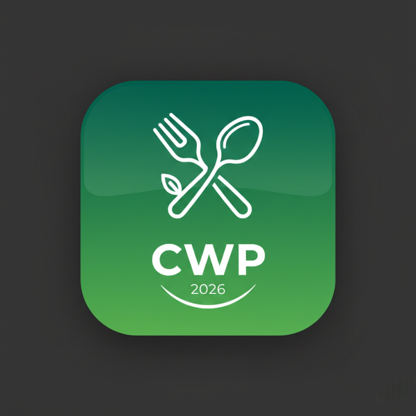

# Cookwise Pro - Comprehensive Recipe Management Application

## Your Ultimate Recipe Companion

Transform your cooking experience with our feature-rich recipe management application.

[Live Demo](#) | [Documentation](#) | [Support](mailto:BarrTechSolutions@gmail.com)

## 📋 Table of Contents

- [Overview](#overview)
- [Features](#features)
- [Getting Started](#getting-started)
- [Usage Guide](#usage-guide)
- [Advanced Features](#advanced-features)
- [Troubleshooting](#troubleshooting)
- [Contributing](#contributing)
- [License](#license)

## Overview

Cookwise Pro is a comprehensive recipe management application designed to revolutionize your kitchen experience. Built with React, Tailwind CSS, and powered by IndexedDB for offline storage, this application offers a seamless way to organize, manage, and enjoy your culinary adventures.

### ✨ Key Benefits

- **Offline Access**: All your recipes stored locally for instant access
- **Cross-device Sync**: Keep your recipes synchronized across devices
- **Smart Organization**: Advanced filtering and categorization options
- **Intuitive Interface**: Beautiful, responsive design with dark/light mode
- **Comprehensive Features**: From meal planning to shopping lists

## Features

### 🍽️ Recipe Management

- **Add Recipes**: Create detailed recipes with ingredients, directions, and nutritional information
- **Edit Recipes**: Modify existing recipes with an intuitive form interface
- **Delete Recipes**: Remove unwanted recipes with confirmation
- **Favorite Recipes**: Mark your favorite recipes for quick access
- **Recipe Search**: Find recipes instantly with powerful search functionality
- **Recipe Categories**: Organize by type, cuisine, dietary restrictions, and tags
- **Image & Video Support**: Attach photos and videos to your recipes
- **Recipe Scaling**: Adjust serving sizes with automatic ingredient scaling
- **PDF Export**: Generate beautiful PDFs of your recipes
- **Recipe Sharing**: Share recipes via native sharing APIs

### 🔍 Smart Discovery

- **Recipe Suggestions**: AI-powered suggestions based on your pantry
- **Seasonal Recipes**: Highlight recipes using seasonal ingredients
- **Ingredient Substitutions**: Smart suggestions for ingredient swaps
- **Rating System**: Rate recipes to track your favorites
- **Personal Notes**: Add custom notes and modifications to recipes

### 📅 Meal Planning

- **Weekly Meal Planner**: Plan meals across seven days
- **Multiple Meal Times**: Breakfast, lunch, dinner, and snack slots
- **Easy Drag-and-Drop**: Intuitive recipe assignment to meal slots
- **Shopping List Integration**: One-click addition of meal plan ingredients

### 🛒 Shopping List

- **Automatic Generation**: Add ingredients from recipes with one click
- **Pantry Integration**: Track what you already have
- **Grouped Ingredients**: Automatically combine duplicate items
- **Check-off Items**: Mark purchased items with cross-outs
- **Unit Conversion**: Switch between imperial and metric measurements
- **Copy to Clipboard**: Easily transfer lists to other apps

### 📦 Pantry Management

- **Ingredient Inventory**: Track what's in your pantry
- **Expiration Tracking**: Monitor expiration dates with alerts
- **Low Stock Alerts**: Get notified when items are running low
- **Auto-add from Shopping List**: Move purchased items to inventory
- **Recipe Availability**: See which recipes you can make with current inventory
- **Categories & Locations**: Organize items by type and storage location

### 📊 Nutrition Tracking

- **Nutrition Dashboard**: Visual overview of weekly nutrition
- **Per-Serving Calculations**: Automatic nutrition breakdowns
- **Estimation Tools**: Estimate nutrition from ingredients
- **Daily Tracking**: Monitor your nutritional intake

### ⏰ Cooking Assistance

- **Cooking Mode**: Full-screen, step-by-step cooking guidance
- **Built-in Timers**: Integrated timers for cooking steps
- **Step-by-Step Navigation**: Easy progression through recipe steps
- **Keyboard Controls**: Navigate with arrow keys and spacebar

### 📁 Collections

- **Recipe Collections**: Group recipes into custom collections
- **Collection Management**: Create, rename, and delete collections
- **Quick Access**: Instant access to themed recipe sets

### 🎨 Customization

- **Dark/Light Mode**: Choose your preferred theme
- **Responsive Design**: Works on phones, tablets, and desktops
- **Customizable UI**: Adjust settings to your preferences
- **Accessibility**: Full keyboard navigation and screen reader support

### 🔐 Data Management

- **Local Storage**: Secure offline data storage
- **Import/Export**: Transfer recipes between devices
- **Backup & Restore**: Protect your recipe collection
- **Cross-Device Sync**: Keep everything synchronized

### ⌨️ Keyboard Shortcuts

- **Quick Navigation**: Ctrl/Cmd + K to search
- **Add Recipe**: Ctrl/Cmd + N
- **Open Meal Plan**: Ctrl/Cmd + M
- **Open Shopping List**: Ctrl/Cmd + L
- **Open Pantry**: Ctrl/Cmd + I
- **Recipe Suggestions**: Ctrl/Cmd + S
- **Open Photo Gallery**: Ctrl/Cmd + G
- **Random Recipe**: Ctrl/Cmd + R
- **Show Shortcuts**: Ctrl/Cmd + H

## Getting Started

### Prerequisites

- Modern web browser (Chrome, Firefox, Safari, Edge)
- Internet connection (for initial load and optional sync)

### Installation

1. Download the application files
2. Open `index.html` in your web browser
3. Start managing your recipes!

### Initial Setup

1. **Create Account** (optional for sync)
2. **Import Existing Recipes** (optional)
3. **Customize Preferences** (theme, units, etc.)

## Usage Guide

### 📝 Adding Your First Recipe

1. **Click "Add Recipe"** button in the header
2. **Fill in recipe details**:
   - Name and description
   - Type, course, and cuisine
   - Serving size and yield
   - Preparation and cooking times
   - Nutritional information
   - Ingredients (one per line)
   - Directions (one per line)
   - Tips and tricks
   - Images and videos
3. **Save the recipe** to your collection

### 🔍 Finding Recipes

1. **Use the search bar** at the top to search by name or type
2. **Apply filters** for specific cuisines, dietary needs, or cooking times
3. **Browse by tags** or use the category filters
4. **Sort by favorites** or recently added

### 📅 Planning Your Meals

1. **Open the Meal Plan** from the menu
2. **Click on a time slot** to select a recipe
3. **Choose from your collection** or search for recipes
4. **Repeat for all desired slots**
5. **Generate shopping list** with one click

### 🛒 Managing Your Shopping List

1. **Add from recipes** by clicking the shopping cart icon
2. **Check off items** as you purchase them
3. **View grouped ingredients** to see combined quantities
4. **Clear the list** when you're done shopping

### 📦 Organizing Your Pantry

1. **Open the Pantry** from the menu
2. **Add items** you currently have
3. **Set quantities** and expiration dates
4. **Track what you have** to avoid duplicate purchases

### �️ Browsing Your Photo Gallery

1. **Open the Photo Gallery** from the menu or press Ctrl/Cmd + G
2. **Browse organized photos** - each recipe's photos are grouped together
3. **View captions** by hovering over photos
4. **Click any photo** to open and view the complete recipe
5. **See photo counts** at a glance for each recipe
6. **Enjoy a beautiful layout** that showcases your culinary creations

### �👨‍🍳 Using Cooking Mode

1. **Open a recipe** you want to cook
2. **Click the "Cook" button**
3. **Follow the full-screen steps**
4. **Use keyboard shortcuts** or tap to advance
5. **Start timers** directly from cooking steps

## Advanced Features

### 📊 Nutrition Analysis

- **Dashboard View**: Weekly nutrition overview
- **Per-Recipe Estimates**: Automatic calculations
- **Custom Values**: Manual nutrition entry

### 🔄 Cross-Device Sync

- **Enable Sync**: Connect accounts across devices
- **Automatic Updates**: Real-time synchronization
- **Conflict Resolution**: Smart merge of changes

### 📸 Recipe Photo Gallery

- **Add Photos**: Attach images to recipes in the Photo Gallery section
- **Caption Support**: Describe your cooking moments with captions
- **Browse Gallery**: Visual gallery view of all recipe photos organized by recipe
- **Photo Grouping**: All photos from each recipe are grouped together for easy browsing
- **One-Click Navigation**: Click any photo to open the full recipe details
- **Professional Layout**: Beautiful responsive grid that adapts to any screen size

### 📈 Analytics & Insights

- **Most Cooked**: Track your popular recipes
- **Cooking Frequency**: Understand your habits
- **Nutrition Trends**: Monitor dietary patterns

### 🎯 Smart Recommendations

- **Based on Pantry**: Recipes you can make now
- **Dietary Preferences**: Tailored suggestions
- **Seasonal Ingredients**: Fresh, seasonal options

### 🖼️ Visual Photo Gallery

- **Organized by Recipe**: Photos are grouped together by their recipe
- **Professional Presentation**: Responsive grid layout that works on all devices
- **Easy Navigation**: Click photos to access full recipe details
- **Photo Information**: View captions and photo counts
- **Beautiful Design**: Elegant hover effects and smooth transitions
- **Mobile Friendly**: Touch-friendly interface for all screen sizes

## Troubleshooting

### Common Issues

- **Slow Loading**: Clear browser cache and reload
- **Sync Problems**: Check internet connection and account status
- **Image Upload**: Ensure files are under 5MB and in supported format
- **Printing Issues**: Use Chrome's print functionality for best results

### Data Recovery

- **Lost Recipes**: Check browser's local storage settings
- **Corrupted Data**: Use the export/import feature to restore
- **Sync Conflicts**: Manual resolution through the sync dashboard

### Performance Tips

- **Large Collections**: Use filters to narrow results
- **Browser Memory**: Close other tabs if experiencing slowdowns
- **Offline Access**: All data remains accessible without internet

## Contributing

We welcome contributions to improve Cookwise Pro!

### Ways to Contribute

- Report bugs and suggest features
- Improve documentation
- Submit pull requests for enhancements
- Translate to other languages
- Create educational content

### Development Setup

1. Fork the repository
2. Clone your fork
3. Make changes
4. Test thoroughly
5. Submit a pull request

## License

This project is licensed under the MIT License - see the LICENSE file for details.

---

**Cookwise Pro** - _Making cooking easier, one recipe at a time_

Made with ❤️ by BarrTech Solutions

For support, contact: [BarrTechSolutions@gmail.com](mailto:BarrTechSolutions@gmail.com)

