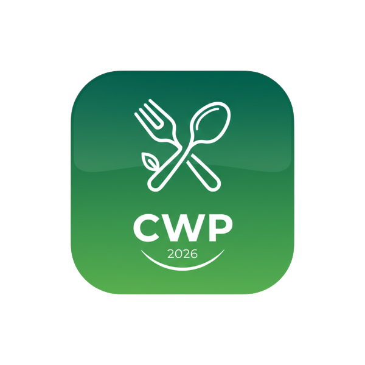

# Cookwise Pro - Comprehensive Recipe Management Application

## Your Ultimate Recipe Companion

Transform your cooking experience with our feature-rich recipe management application powered by React, Tailwind CSS, and IndexedDB—all offline and completely free.

**[Getting Started](#getting-started) | [Features](#features) | [Tutorial](#tutorial) | [Keyboard Shortcuts](#keyboard-shortcuts) | [Support](mailto:BarrTechSolutions@gmail.com)**

---

## 📋 Table of Contents

- [Overview](#overview)
- [Key Benefits](#key-benefits)
- [Features](#features)
- [Getting Started](#getting-started)
- [Usage Guide](#usage-guide)
- [Keyboard Shortcuts](#keyboard-shortcuts)
- [Tutorial](#tutorial)
- [Advanced Features](#advanced-features)
- [Troubleshooting](#troubleshooting)
- [Contributing](#contributing)
- [License](#license)

---

## Overview

Cookwise Pro is a comprehensive, offline-first recipe management application designed to revolutionize your kitchen experience. Whether you're a home cook, meal planner, or culinary enthusiast, Cookwise Pro provides everything you need to organize, discover, and enjoy your recipes.

### ✨ Key Benefits

- **💾 Offline Access**: All recipes stored locally on your device—no internet required after loading
- **🔄 Cross-Device Sync**: Optional cloud synchronization to keep recipes in sync across devices
- **🎨 Beautiful Interface**: Modern, responsive design with dark/light mode support
- **⚡ Lightning Fast**: Instant search and filtering with no lag
- **🛡️ Privacy First**: Your recipes never leave your device unless you choose to sync
- **📱 Mobile Friendly**: Works seamlessly on phones, tablets, and desktops

---

## Features

### 🍽️ Recipe Management

- **➕ Add Detailed Recipes**: Create recipes with ingredients, directions, prep/cook times, and nutritional info
- **✏️ Edit & Organize**: Modify recipes anytime with full control over all fields
- **🏷️ Smart Categorization**: Organize by type (breakfast, lunch, dinner, snack), cuisine, dietary restrictions, and custom tags
- **⭐ Favorite Marking**: Mark favorites for quick access and special displays
- **🖼️ Rich Media Support**: Attach multiple photos with captions to visualize your dishes
- **📊 Nutritional Information**: Full macronutrient tracking (calories, protein, carbs, fats, fiber)
- **⚖️ Recipe Scaling**: Automatically adjust ingredient quantities for different serving sizes
- **📄 PDF Export**: Generate beautiful, printable recipe cards
- **🔍 Powerful Search**: Find recipes by name, ingredient, type, or cuisine instantly
- **⭐ Rating System**: Rate and review recipes to track your favorites

### 📸 Photo Management

#### Photo Gallery (Classic View) - `Ctrl/Cmd + G`

- Browse all recipe photos in one organized interface
- Photos grouped by recipe with photo counts
- Click any photo to open the full recipe details
- Beautiful responsive grid layout
- Professional hover effects and transitions

#### Photo Album (Browsable View) - `Ctrl/Cmd + A` ⭐ NEW!

- **📸 Advanced Photo Browser**: Browse all recipe photos in a single searchable interface
- **🔍 Filter by Recipe**: Quickly filter photos by selecting specific recipes
- **🎨 Adjustable Grid Density**: Choose between compact, normal, or spacious layouts
- **📱 Responsive Design**: Works perfectly on all screen sizes
- **✨ Beautiful Grid Layout**: Professional presentation with smooth hover effects
- **📊 Photo Counter**: See total photos and recipes at a glance

#### Photo Lightbox (Full-Screen Viewer) ⭐ NEW!

- **🔍 Full-Screen Viewing**: Enlarge and view photos in immersive full-screen mode
- **➡️ Navigation**: Navigate between photos with intuitive Previous/Next buttons or arrow keys
- **🔎 Zoom Feature**: Toggle zoom for detailed inspection (press Z)
- **📤 Share Button**: Share photos via native share APIs or copy to clipboard
- **🎨 Professional Display**: Beautiful dark overlay with recipe info and photo counter
- **↕️ Smooth Navigation**: Navigate photos without accidentally closing the album

### 📅 Meal Planning

- **📆 Weekly Planner**: Plan meals across seven days with visual calendar
- **🕐 Multiple Meal Times**: Breakfast, lunch, dinner, and snack slots for each day
- **🔄 Easy Assignment**: Intuitive recipe selection and assignment
- **➕ Bulk Add Option**: Add multiple recipes at once, assigning different dates and meal times to each
- **🛒 Shopping List Integration**: Convert meal plan ingredients into shopping list with one click
- **📋 Auto-Combine Ingredients**: Duplicate ingredients automatically combined with quantity updates
- **✏️ Edit Anytime**: Modify meal plans on the fly

### 🛒 Shopping List

- **📝 Multiple Sources**: Add items from recipes, meal plans, or manually
- **🔀 Auto-Grouping**: Duplicate ingredients automatically combined
- **✅ Track Progress**: Check off items as you shop
- **📋 Copy Lists**: Easy copy-to-clipboard for sharing
- **⚖️ Unit Conversion**: Switch between metric and imperial measurements
- **📊 Quantity Tracking**: See total quantities of combined ingredients
- **🗑️ Bulk Clear**: Clear entire list when done shopping

### 📦 Pantry Management

- **🥫 Inventory Tracking**: Track all ingredients you currently have
- **⏰ Expiration Dates**: Monitor expiration with color-coded alerts
- **⚠️ Low Stock Warnings**: Get notified when items are running low
- **📍 Storage Organization**: Categorize items by location
- **🔗 Shopping List Integration**: Move purchased items to pantry
- **🍳 Recipe Availability**: See which recipes you can make with current pantry items
- **📊 Inventory Dashboard**: Visual overview of your pantry contents

### 📊 Nutrition Tracking

- **📈 Weekly Overview**: Visual dashboard of your weekly nutrition
- **🔢 Per-Serving Calculations**: Automatic macronutrient breakdowns
- **📊 Macro Tracking**: Monitor protein, carbs, fat, and fiber intake
- **🎯 Dietary Goals**: Track against personal nutrition goals

### ⏰ Cooking Mode

- **👨‍🍳 Full-Screen Cooking**: Dedicated, distraction-free cooking interface
- **📍 Step-by-Step Guide**: Clear, readable instructions for each step
- **⏱️ Built-in Timers**: Set timers directly for cooking steps
- **⌨️ Keyboard Controls**: Navigate with arrow keys or space bar
- **🎯 Progress Tracking**: See your progress through the recipe
- **📱 Large Text**: Optimized for readability while cooking

### 🍄 Recipe Discovery

- **🤖 Smart Suggestions**: AI-powered recipe recommendations based on your pantry
- **🌿 Seasonal Ingredients**: Discover recipes using seasonal produce
- **📚 Browse by Category**: Explore recipes by type or cuisine
- **🎲 Random Recipe**: Press Ctrl/Cmd + R for a surprise meal idea

### 🎨 Customization & Interface

- **🌙 Dark/Light Mode**: Choose your preferred theme
- **📱 Fully Responsive**: Perfect display on phones, tablets, and desktops
- **🎨 Modern Design**: Beautiful interface with Tailwind CSS styling
- **♿ Accessibility**: Full keyboard navigation and screen reader support
- **⌨️ Keyboard Shortcuts**: Power user shortcuts for every major feature

### 🔐 Data Management

- **💾 Local Storage**: All recipes stored securely on your device
- **📤 Export Recipes**: Export your collection as JSON or PDF
- **📥 Import Recipes**: Easily import recipes from other sources
- **☁️ Cloud Sync** (Optional): Sync across devices with optional cloud backup
- **🔒 Privacy Focused**: Your data is yours—no tracking, no ads

---

## Getting Started

### Prerequisites

✓ Modern web browser (Chrome, Firefox, Safari, Edge, or any Chromium-based browser)
✓ Internet connection for initial load (optional for regular use—works offline!)

### Installation

1. **Download** the application files
2. **Open** `index.html` in your web browser
3. **Start cooking!** Your recipes are stored locally

### First Time Setup

1. **Explore the Interface**: Familiarize yourself with the header navigation
2. **Add Your First Recipe**: Click "Add Recipe" and create a simple recipe
3. **View Keyboard Shortcuts**: Press `Ctrl/Cmd + H` to see all available shortcuts
4. **Customize Preferences**: Set your preferred theme (dark/light mode)
5. **Start Organizing**: Begin adding your favorite recipes

---

## Usage Guide

### 📝 Adding Your First Recipe

1. Click **"Add Recipe"** (or press **Ctrl/Cmd + N**)
2. Fill in recipe details:
   - Name and description
   - Type (breakfast, lunch, dinner, snack, dessert)
   - Cuisine type
   - Serving size and prep/cook times
   - Ingredients (format: "2 cups flour")
   - Directions (step-by-step)
   - Nutritional info (optional)
   - Photos with captions
   - Tips and modifications
3. Click **"Save Recipe"** - instantly saved locally!

### 🔍 Finding Recipes

- **Search Bar**: Press **Ctrl/Cmd + K** to search by name or ingredient
- **Filters**: Filter by type, cuisine, cooking time, and dietary restrictions
- **Favorites**: Click the star to favorite recipes
- **Collections**: Browse by meal type or cuisine

### 📅 Planning Your Meals

**Quick Add:**

1. Click **"Meal Plan"** (or press **Ctrl/Cmd + M**)
2. Click any meal slot (breakfast, lunch, dinner, snack)
3. Select a recipe and confirm

**Bulk Add Multiple Recipes:**

1. Select multiple recipes (check the boxes)
2. Click **"Add to Meal Plan"** → **"Select Multiple"**
3. For each recipe, choose date and meal time
4. Click **"Add All"**

### 📸 Browsing Your Photos

**Classic Gallery** (`Ctrl/Cmd + G`):

- Browse all recipe photos organized by recipe
- Click any photo to open the recipe

**New Album View** (`Ctrl/Cmd + A`) ⭐:

- **Filter photos**: Select specific recipe
- **Adjust density**: Compact/Normal/Spacious
- **Hover over photos**: See recipe name and caption
- **Click any photo**: Opens immersive lightbox viewer

**Photo Lightbox** (Full-Screen):

- **← / → keys or buttons**: Navigate between photos
- **Z key**: Toggle zoom
- **Share button**: Share or copy link
- **Esc**: Close lightbox

### 👨‍🍳 Using Cooking Mode

1. Open any recipe
2. Click **"Cook"** button
3. Full-screen cooking interface with:
   - Recipe photo and name
   - Large, readable ingredients
   - Step-by-step directions
   - Built-in timers
4. Navigate with arrow keys or spacebar
5. Press Esc to exit

### 🛒 Shopping List Guide

1. **Add Items**: From recipes, meal plans, or manually
2. **Check Off**: Mark items as you shop
3. **View Grouped**: See combined quantities
4. **Export**: Copy to clipboard or print

---

## Keyboard Shortcuts

### Main Navigation

| Shortcut         | Action                       |
| ---------------- | ---------------------------- |
| **Ctrl/Cmd + K** | Focus search bar             |
| **Ctrl/Cmd + N** | Add new recipe               |
| **Ctrl/Cmd + M** | Open meal plan               |
| **Ctrl/Cmd + L** | Open shopping list           |
| **Ctrl/Cmd + I** | Open pantry inventory        |
| **Ctrl/Cmd + S** | Show recipe suggestions      |
| **Ctrl/Cmd + G** | Open photo gallery           |
| **Ctrl/Cmd + A** | Open photo album (browsable) |
| **Ctrl/Cmd + R** | Get random recipe            |
| **Ctrl/Cmd + H** | Show keyboard shortcuts      |

### Photo Lightbox (when viewing photos)

| Shortcut  | Action                  |
| --------- | ----------------------- |
| **← / →** | Navigate between photos |
| **Z**     | Toggle zoom in/out      |
| **Esc**   | Close lightbox          |

### Cooking Mode

| Shortcut       | Action                |
| -------------- | --------------------- |
| **Arrow Keys** | Navigate recipe steps |
| **Space**      | Next step             |
| **Esc**        | Exit cooking mode     |

### General

| Shortcut | Action          |
| -------- | --------------- |
| **Esc**  | Close any modal |

---

## Tutorial

### Part 1: Getting Started (5 minutes)

1. **Open the App** - Notice the clean interface with search bar, title, and action buttons
2. **Explore the Header** - Check out all available sections
3. **View Your Theme** - Click settings and toggle dark/light mode
4. **Try the Shortcuts** - Press `Ctrl/Cmd + H` to see all shortcuts

### Part 2: Adding Recipes (10 minutes)

1. **Click "Add Recipe"** or press **Ctrl/Cmd + N**
2. **Fill Basic Info**: Name, type, cuisine
3. **Add Timing**: Prep time, cook time, servings
4. **Add Ingredients**: One per line (e.g., "2 cups flour")
5. **Add Directions**: Step-by-step instructions
6. **Add Photos** (recommended): Upload images with captions
7. **Save**: Click green "Save" button

### Part 3: Searching & Filtering (5 minutes)

1. **Use Search**: Press **Ctrl/Cmd + K** and type recipe name or ingredient
2. **Apply Filters**: Filter by type, cuisine, and cooking time
3. **View Favorites**: Star recipes and view favorites only

### Part 4: Meal Planning (10 minutes)

1. **Open Meal Plan** (`Ctrl/Cmd + M`)
2. **Quick Add**: Click meal slot → select recipe
3. **Bulk Add**: Select multiple recipes → assign different dates/times
4. **Generate Shopping List**: One-click ingredient compilation

### Part 5: Shopping & Pantry (10 minutes)

1. **Open Shopping List** (`Ctrl/Cmd + L`) - See meal plan ingredients
2. **Check Off Items**: Mark as shopping progresses
3. **Open Pantry** (`Ctrl/Cmd + I`) - Add items you have at home
4. **Track Inventory**: See what recipes you can make

### Part 6: Cooking Mode (5 minutes)

1. **Select Recipe** → Click **"Cook"**
2. **Full-Screen Interface**: Photo, ingredients, directions
3. **Navigate**: Arrow keys or spacebar
4. **Exit**: Press Esc

### Part 7: Photo Gallery & Album (8 minutes) ⭐ NEW!

1. **Open Gallery** (`Ctrl/Cmd + G`): Classic view, photos grouped by recipe
2. **Open Album** (`Ctrl/Cmd + A`):
   - **Filter by Recipe**: Select specific recipe
   - **Adjust Density**: Compact, Normal, or Spacious
   - **Hover**: See recipe name and caption
   - **Click Photo**: Opens full-screen lightbox

3. **Use Lightbox**:
   - **Navigate**: Arrow keys or Previous/Next buttons
   - **Zoom**: Press Z or click Zoom button
   - **Share**: Click Share for native or clipboard
   - **Close**: Press Esc or click X

### Part 8: Mastering Shortcuts (3 minutes)

1. **Press Ctrl/Cmd + H**: View all shortcuts
2. **Practice Daily**: Remember top shortcuts for faster work
3. **Most Useful**: K (search), M (meal plan), L (shopping), A (album), R (random)

---

## Advanced Features

### 🔄 Recipe Scaling

1. Open recipe
2. Change "Servings" number
3. All ingredient quantities automatically adjust
4. Perfect for feeding different group sizes

### 📊 Nutrition Dashboard

1. Click **"Nutrition Dashboard"**
2. View weekly nutrition totals
3. Monitor calories, protein, carbs, fat, fiber
4. Plan meals based on nutrition goals

### 🤖 Recipe Suggestions

1. Press **Ctrl/Cmd + S**
2. App analyzes your pantry and history
3. Get personalized recipe recommendations
4. Discover dishes you can cook now

### 📤 Import/Export

1. Go to **Settings** → **Data**
2. **Export**: Backup all recipes as JSON
3. **Import**: Add recipes from JSON file
4. **Share**: Send recipes to others

### ☁️ Cloud Sync (Optional)

1. Go to **Settings** → **Sync**
2. Create account and enable sync
3. Recipes automatically sync to other devices
4. All changes reflected everywhere

---

## Troubleshooting

### 📱 Common Issues

| Problem                   | Solution                                              |
| ------------------------- | ----------------------------------------------------- |
| **App won't load**        | Clear cache (Ctrl+Shift+Del), refresh page            |
| **Recipes disappeared**   | Export backups regularly. Stored in browser IndexedDB |
| **Photos won't upload**   | Keep images under 5MB. Use PNG or JPG format          |
| **Slow performance**      | Use filters/search. Close other browser tabs          |
| **Sync not working**      | Check internet connection. Re-enable in settings      |
| **Shortcuts not working** | Make sure you're not in a text input field            |

### 💾 Data Recovery

- **Lost recipes**: Check for exported backups
- **Pro Tip**: Regularly export recipes for backup
- **Data location**: Stored in browser's local IndexedDB
- **Warning**: Don't clear browser data without backup!

### ⚡ Performance Tips

- Use search/filters for large collections
- Close unused browser tabs
- Disable animations if scrolling is slow
- Compress photos before uploading

---

## Contributing

We welcome contributions to improve Cookwise Pro!

### Ways to Help

- Report bugs and suggest features
- Improve documentation and tutorials
- Translate to other languages
- Share recipes with the community

### Reporting Bugs

Send details to: [BarrTechSolutions@gmail.com](mailto:BarrTechSolutions@gmail.com)

Include:

- What you were doing
- What you expected to happen
- What actually happened
- Browser and device info

---

## License

This project is licensed under the MIT License.

---

## 🎉 Thank You for Using Cookwise Pro!

**Making cooking easier, one recipe at a time.**

Made with ❤️ by BarrTech Solutions

Questions? Contact us: [BarrTechSolutions@gmail.com](mailto:BarrTechSolutions@gmail.com)

